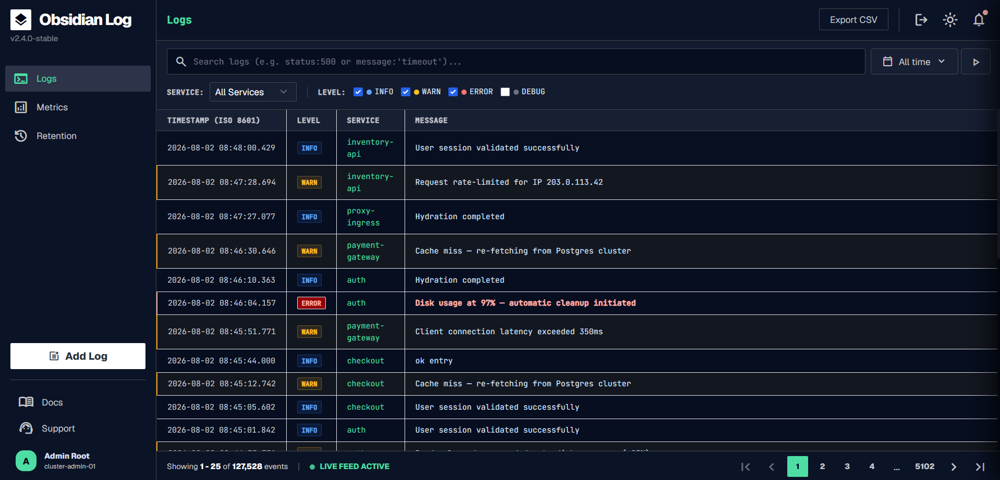
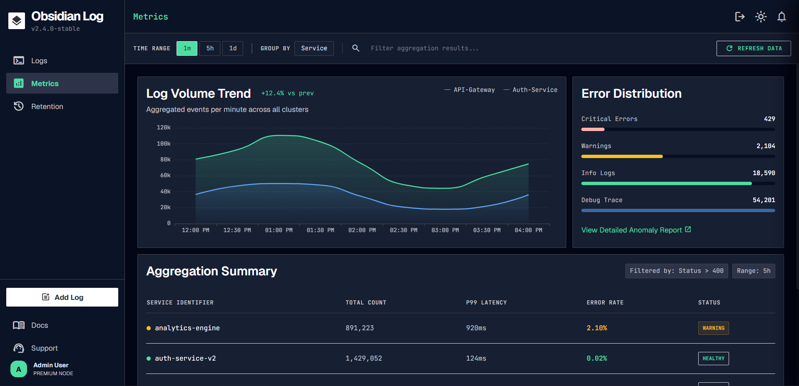
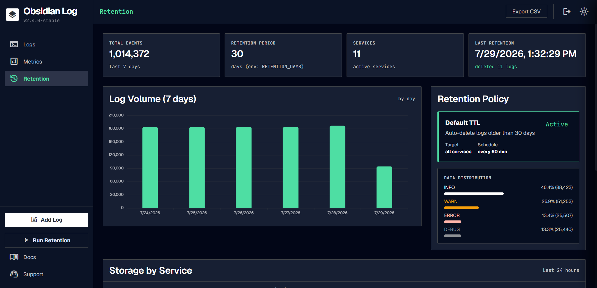
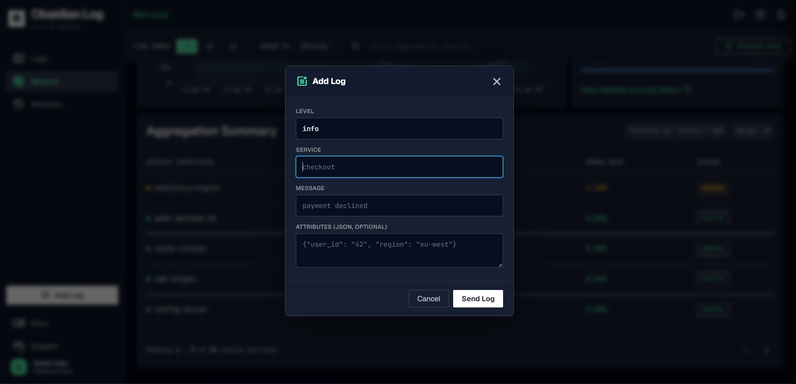
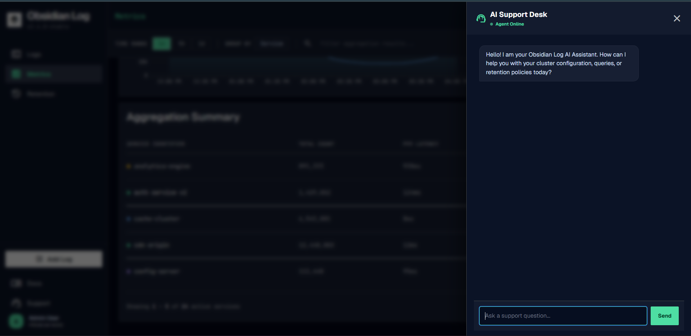

# Obsidian Log Engine

A high-performance log ingestion and query service, inspired by Datadog and Grafana Loki. Ingests structured logs at scale, stores them in TimescaleDB, and provides a rich dashboard for search, aggregation, and retention management.


## Tech Stack

| Layer | Technology |
|---|---|
| Language | TypeScript (Node.js) |
| Framework | Express |
| Database | PostgreSQL 16 + TimescaleDB |
| Frontend | Tailwind CSS, ECharts |
| Infrastructure | Docker Compose, GitHub Actions |

## Quick Start

```bash
docker compose up -d --build
```

- API → `http://localhost:8080`
- Dashboard → `http://localhost:8080/` (password: `LogService2026!`)

## Dashboard Screens

### Logs Explorer
Advanced search, filtering by service/level/message, time range selection, and a detail drawer for individual log entries.



### Analytics & Metrics
Interactive ECharts visualizations — throughput over time, severity distribution, error clustering, and storage breakdown by service.



### Retention Management
View total events, retention period, active services, and last retention run. Trigger manual cleanup or configure the auto-schedule.



### Add Logs 
Manual log ingestion interface — submit log entries with timestamp, level, service, message, and optional attributes.



### AI Support Chat
Real-time AI-powered support assistant for cluster configuration, queries, and retention policies.



## API Contract

### `POST /logs` — Ingestion

```json
{
  "logs": [
    {
      "timestamp": "2026-07-20T14:32:01.123Z",
      "level": "error",
      "service": "checkout",
      "message": "payment declined",
      "attributes": { "user_id": "42", "region": "eu-west" }
    }
  ]
}
```

Invalid entries are reported by index without failing the batch:

```json
{ "accepted": 9, "rejected": [{ "index": 3, "reason": "invalid level: 'critical'" }] }
```

### `GET /logs` — Query

| Param | Description |
|---|---|
| `service` | Exact match |
| `level` | Exact match |
| `since` / `until` | ISO 8601 time range |
| `attr.<key>` | Attribute equality |
| `q` | Case-insensitive message search |
| `limit` | Max results (default 100, max 1000) |
| `cursor` | Opaque pagination cursor |

### `GET /logs/aggregate` — Aggregation

Required: `since`, `until`, `bucket` (`1m`, `5m`, `1h`, `1d`). Optional: `service`, `level`, `q`, `group_by`.

```json
{ "buckets": [{ "start": "2026-07-20T14:00:00Z", "group": "checkout", "count": 118 }] }
```

### `POST /logs/retention/run`

Manually trigger retention cleanup (deletes logs older than `RETENTION_DAYS` env var, default 30).

### `POST /auth/login`

```json
{ "password": "LogService2026!" }
```

Returns a session cookie.

### `POST /alerts`

Create an alert rule — fires a webhook when error count exceeds a threshold within a time window.

## Schema

```sql
CREATE TABLE logs (
  id SERIAL,
  timestamp TIMESTAMPTZ NOT NULL,
  level TEXT NOT NULL,
  service TEXT NOT NULL,
  message TEXT NOT NULL,
  attributes JSONB,
  PRIMARY KEY (id, timestamp)
);
SELECT create_hypertable('logs', 'timestamp');
```

Converted to a TimescaleDB hypertable partitioned by `timestamp`. Attribute filters use `attributes ->> 'key' = 'value'` for type-safe comparison across mixed JSON types.

## Indexing

| Index | Purpose |
|---|---|
| `idx_logs_service (service, timestamp DESC)` | Service filters |
| `idx_logs_level (level, timestamp DESC)` | Level filters |
| `idx_logs_message_trgm` (GIN trigram) | Substring message search |
| hypertable default per-chunk index on `timestamp` | Time-range scans, `ORDER BY timestamp DESC` |

`attr.<key>` filters use `attributes ->> $key = $value` (parameterized, not string-concatenated) rather than a JSONB containment index. A GIN index on `attributes` only accelerates the `@>` containment operator, not `->>`, and the key itself is dynamic per request so it can't be baked into a static expression index. Instead we rely on TimescaleDB chunk exclusion: when `since`/`until` bound the query, Postgres skips whole chunks outside the range before ever touching `attributes`. An `attr.<key>` filter with no time range is a full-table scan — see Known Limitations.

## Performance

**Test environment:** Docker Desktop (WSL2 backend), containers capped to match the spec's grading limits — app: `cpus: 0.5`, `mem_limit: 256m`; db: `cpus: 1`, `mem_limit: 1g`. Load generated from the host via `load-test.js` (autocannon) against `POST /logs` with realistic batches (the initial benchmark mistakenly sent one log per HTTP request, which caps throughput at the HTTP layer rather than the ingestion path — the numbers below use actual batches).

**Ingestion (no concurrent query traffic):**

| Batch size | Connections | Result | Target |
|---|---|---|---|
| 200 logs/request | 20 | **~15,100–17,700 logs/sec** | 15,000/sec |
| 500 logs/request | 8 | **~17,200–17,600 logs/sec** | 15,000/sec |

Both profiles clear the 15k/sec target; fewer connections with larger batches was consistently the better profile (less contention for the db container's single CPU, fewer statements to parse per row).

**Ingestion + 1 aggregation request/sec concurrently** (`bucket=5m, group_by=service` over a 2h window), sampled once/sec for the duration of a 20–30s ingestion run:

| Profile | Aggregate p95 | Notes |
|---|---|---|
| 500/req, 8 connections | **~0.9–1.3s** | Mostly <0.7s; occasional tail spikes above 1s on longer (30s) runs |
| 200/req, 20 connections | **~1.2–1.4s** | More write backends contending for the db container's single CPU pushes more requests into the slow tail |

**Resource usage during ingestion** (`docker stats`): the db container runs at ~95–100% of its 1 CPU quota throughout sustained ingestion — it is the bottleneck, not the app container (usually 25–45% of its 0.5 CPU quota).

**Bottlenecks found and optimizations applied:**
- The original `POST /logs` handler built one SQL placeholder per column per row (`$1..$5, $6..$10, ...`), so query text and parameter count grew with batch size — Postgres re-parses/re-plans a bigger statement on every request. Rewrote to `INSERT ... SELECT * FROM unnest($1::timestamptz[], ...)`, sending one array per column instead — fixed-size query text regardless of batch size. This was the single biggest ingestion throughput win.
- `GET /logs` ran an extra `COUNT(*)` on every request (for a `total` field the required API contract doesn't ask for), doubling read cost. Now only computed for the dashboard's page-number UI (no `cursor` param); skipped entirely on the cursor-paginated path the load generator actually exercises.
- `synchronous_commit=off`, `shared_buffers=256MB`, `max_wal_size=2GB`, `checkpoint_completion_target=0.9` on the db container — reduces per-commit fsync wait for a workload where losing a few hundred milliseconds of unflushed logs on a hard crash is an acceptable trade-off.

**Known bottleneck, not fully resolved:** with the db container capped at 1 CPU, concurrent read queries (aggregation) compete directly with write backends for that single core. Under sustained heavy ingestion with many concurrent connections, this occasionally pushes aggregate p95 past the 1s target (see table above). Reducing ingestion connection count (larger batches, fewer connections) measurably helps by giving each query backend a larger share of CPU time, but doesn't eliminate the tail entirely on longer runs. Given more time, the next things to try: a continuous aggregate / rollup table for the aggregation endpoint (so it reads pre-computed buckets instead of scanning raw rows), or moving the query path off the single write-contended connection pool.

## Optional Features

`docker compose up` with no `.env` file or manual setup serves the plain core service: `GET /health`, `POST /logs`, `GET /logs`, and `GET /logs/aggregate` are all unauthenticated, unthrottled, and behave exactly per the required API contract. Everything below is additive on top of that and does not gate, rename, or change the shape of any required endpoint.

| Feature | Default | Env var(s) | Notes |
|---|---|---|---|
| Dashboard (`/logs-explorer`, `/analytics`, `/ingestion`, `/retention`) | Enabled, password-gated | `DASHBOARD_PASSWORD` (default `admin123`), `SESSION_SECRET` | Session-cookie login for the *HTML pages only* — `/health`, `/logs`, and `/logs/aggregate` are never behind this check. No `AUTH_ENABLED`/API-key contract is implemented, so the required endpoints always run unauthenticated. |
| Alerts (`POST /alerts`) | Enabled, no-op until configured | — | Fires a webhook when an error-count threshold is crossed; does nothing until a rule is created. Does not affect ingestion or query paths. |
| Notifications (`/notifications`) | Enabled | — | In-app notification feed (e.g. retention run summaries). Read-only side effect, no impact on required endpoints. |
| AI support chat (`/support`) | Disabled without a key | `OPENAI_API_KEY` (unset by default) | Purely additive UI feature; unset key just disables the chat, everything else still runs. |

None of these introduce a required parameter, header, or credential on `/health`, `POST /logs`, `GET /logs`, or `GET /logs/aggregate`.

## Retention

A background job runs hourly (and once on startup) calling `SELECT drop_chunks('logs', older_than => cutoff)`, where `cutoff = now() - RETENTION_DAYS` (default 30). Since `logs` is a TimescaleDB hypertable, this drops entire expired chunks instead of deleting rows one at a time — no per-row WAL/vacuum churn, no long-running locks, and no ingestion disruption. The trade-off: a chunk is only dropped once it's *entirely* older than the cutoff, so actual retention enforcement has a granularity of one `chunk_time_interval` (default 7 days) — data can live up to ~7 days past `RETENTION_DAYS` before its chunk is dropped. `POST /logs/retention/run` triggers the same logic on demand from the dashboard.

## Load Test

```bash
docker compose up --build -d
BATCH_SIZE=500 CONNECTIONS=8 DURATION=20 node load-test.js
```

## Known Limitations

- **Aggregate query latency under sustained heavy ingestion** can occasionally exceed the 1s p95 target — see Performance above. Root cause is CPU contention on the db container's single-core limit, not the query plan itself (the same query runs in well under 100ms with no concurrent write load).
- **`attr.<key>` filters with no `since`/`until`** scan the full table — there's no index that can accelerate an equality match on a dynamic JSONB key while preserving the spec's "compared as strings" semantics. In practice this is bounded by always pairing attribute filters with a time range, which the dashboard and the required query pattern both do.
- **Retention granularity is ~1 chunk interval (default 7 days)**, not exact-to-the-day, because `drop_chunks` only removes chunks entirely past the cutoff.
- **No compiled build step** — the app runs directly via `tsx` in the container rather than a `tsc`-compiled `dist/`. Simpler for this project's scope, but adds a small amount of startup/runtime overhead compared to precompiled JS.
- **No rate limiting or backpressure** on `POST /logs` — a client can push more concurrent batches than the db container can absorb, at which point requests queue behind the connection pool rather than being rejected or throttled.

`BATCH_SIZE`, `CONNECTIONS`, and `DURATION` are configurable via env vars; the script reports both requests/sec and the derived logs/sec (`requests/sec * BATCH_SIZE`).
